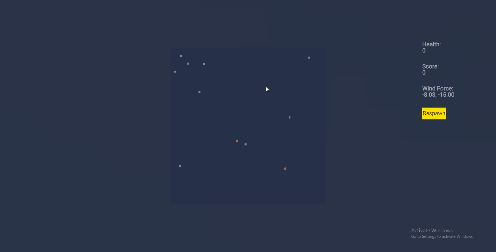

# Geometry Wars KW Server



## 🎮 Project Overview

* **Goal:** A multiplayer, multiplatform action shooter inspired by Geometry Wars, developed as a technical test for a Backend Programmer role.
* **Core Technologies:**
    * **Client:** PlayCanvas (JavaScript, Web)
    * **Server:** Colyseus (TypeScript, Node.js)
    * **Deployment:** AWS EC2 (Free Tier), Docker, Docker Compose, Nginx Proxy Manager (with Let's Encrypt SSL), Redis
    * **CI/CD:** GitHub Actions

---

## 🏗️ Architecture

* **Client (PlayCanvas):** Connects via Secure WebSocket (`wss://`) to the Nginx Proxy Manager. Handles rendering, user input, and client-side prediction/interpolation.
* **Nginx Proxy Manager (Docker):** Acts as a reverse proxy, handling SSL termination (Let's Encrypt) and routing traffic (including WebSocket upgrades) to the correct game server container based on the domain name. Runs in a separate Docker Compose setup for isolation.
* **Game Server (Colyseus - Docker/PM2):** Runs the core game logic (`GameSimulation`), manages player state (Schema), handles client messages, synchronizes state, and connects to Redis. Uses PM2 internally to leverage multiple CPU cores (vertical scaling). Runs in its own Docker Compose setup.
* **Redis (Docker):** Used as the Colyseus Presence driver. Enables communication and coordination between multiple game server *processes* (via PM2) allowing for scalability. Runs alongside the game server in its Docker Compose setup.
* **External Data (Open Meteo API):** Fetched *once* on server startup by a `WeatherService`, cached, and used to influence game mechanics (Arena Currents) per match.


---

## ✨ Features Implemented

*Focus on backend relevance.*

* **Real-time Multiplayer:** Using Colyseus for state synchronization and WebSocket communication.
* **Server-Authoritative Logic:** Core gameplay (movement, shooting, collisions, scoring, health) is managed server-side for fairness.
* **Scalable Architecture:**
    * **Containerization:** Fully containerized using Docker and Docker Compose for consistent deployment.
    * **Redis Presence:** Integrated Redis to allow multiple server processes (via PM2) to coordinate, demonstrating readiness for horizontal scaling.
    * **PM2 Clustering:** Uses PM2 within the container to utilize all available CPU cores on the host machine (vertical scaling within the instance).
* **Dynamic Difficulty:** Implemented a "Threat System" that scales enemy spawns based on elapsed time and current player count, providing a dynamic challenge instead of rigid waves.
* **External Data Integration:** Fetches historical weather data (Typhoon Ragasa) in Philippines 2025/09/01 to 2025/09/30 on server startup, caches it, and uses it to apply dynamic "Arena Currents" (wind force) per match. Demonstrates connecting to external services and processing data.
* **Performance / Optimization:**
    * **Efficient Collision Detection:** Spatial Grid is implemented on the server side to addresse the potential $O(N^2)$ complexity of collision checks.
    * **Optimized Network Input:** Client input (movement, aiming) is only sent to the server **on change**, drastically reducing unnecessary network traffic compared to sending updates every frame.
    * **Smooth Synchronization:** Utilizes **Colyseus Schema** for efficient binary state synchronization. Client-side **interpolation (`EntityInterpolator.mjs`)** is used to smoothly render entity movement and rotation between server updates, providing a visually fluid experience despite network latency.
* **Basic Security / Anti-Cheat:**
    * **Server-Side Validation:** Includes checks to prevent basic speed hacks (validating movement distance) and enforce fire rate limits server-side.
    * **Secure Connections:** Uses Nginx Proxy Manager for SSL termination (`wss://`), preventing mixed-content issues and encrypting traffic.
* **Deployment & CI/CD:**
    * **AWS EC2 Deployment:** Successfully deployed on a free-tier EC2 instance.
    * **Automated Deployment:** Configured GitHub Actions for continuous deployment, automatically pulling, rebuilding, and restarting the server on pushes to the main branch.
* **Gameplay Mechanics:** Includes player health, respawn, scoring, multiple enemy types with distinct AI (Strategy Pattern), spawn invulnerability, post-hit invulnerability, and visual feedback (color, flash).

---

## 🛠️ Local Development Setup

* **Prerequisites:** Docker, Docker Compose, Node.js (for client development if needed), Git.
* **Clone:** `git clone <your-repo-url>`
* **Environment:**
    * Copy `.env.development.example` to `.env.development`.
    * Copy `.env.production.example` to `.env.production` (used by Docker Compose). Ensure `NODE_ENV=production` and `PORT=2567` are set.
* **Build & Run:**
    ```bash
    # From the project root directory
    docker-compose up -d --build
    ```
* **Access:**
    * Game Server: `ws://localhost:2567` (Connect PlayCanvas client here for local testing without Nginx)
    * Redis: (Not directly accessible, used by the server container)
* **Stop:** `docker-compose down`

---

## 🚀 Deployment (AWS EC2)

* **Infrastructure:** AWS EC2 (Ubuntu), Docker, Docker Compose, Nginx Proxy Manager.
* **Setup:**
    1.  Provision EC2 instance, configure Security Group (allow ports 22, 80, 443).
    2.  Install Docker, Docker Compose, Git.
    3.  Create a shared Docker network (`docker network create my-shared-network`).
    4.  Set up Nginx Proxy Manager in `~/nginx-proxy-manager` using its `docker-compose.yml` (attaching to the shared network). Configure domain, SSL (Let's Encrypt), and WebSocket support via its UI (Port 81).
    5.  Clone the game server repo to `~/Geometry-Wars-KW-Server`. Place `.env.production`.
* **CI/CD:** GitHub Actions workflow (`.github/workflows/deploy.yml`) handles deployment:
    1.  Triggers on push to `main`.
    2.  SSHes into EC2 using secrets (Host, User, Private Key).
    3.  Runs `git reset --hard HEAD`, `git pull`.
    4.  Runs `docker-compose down`, then `docker-compose up -d --build`.
    5.  Prunes old images.
* **Access:** `wss://your-domain.com`

---

## ⏭️ Potential Future Improvements (Optional)

* Add more enemy types with diverse AI.
* Implement database persistence for high scores.
* Add more robust anti-cheat measures (e.g., input validation).
* Implement graceful shutdown (`gameServer.gracefulShutdown()`).